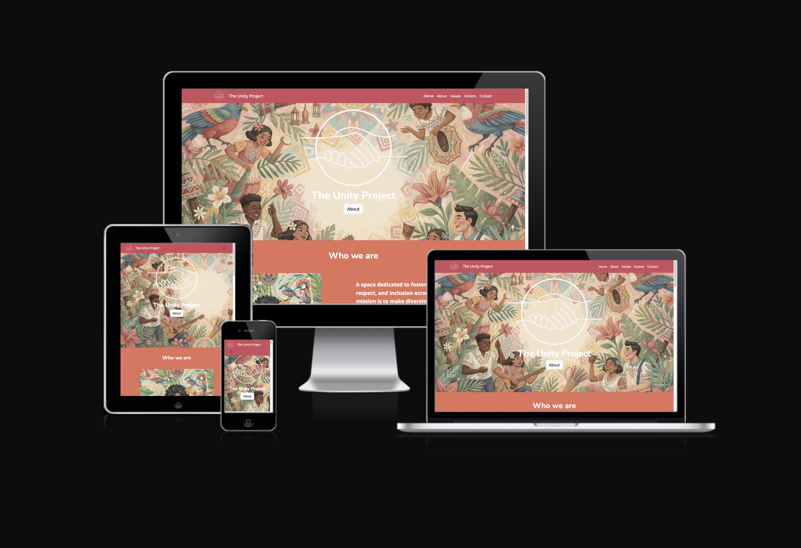
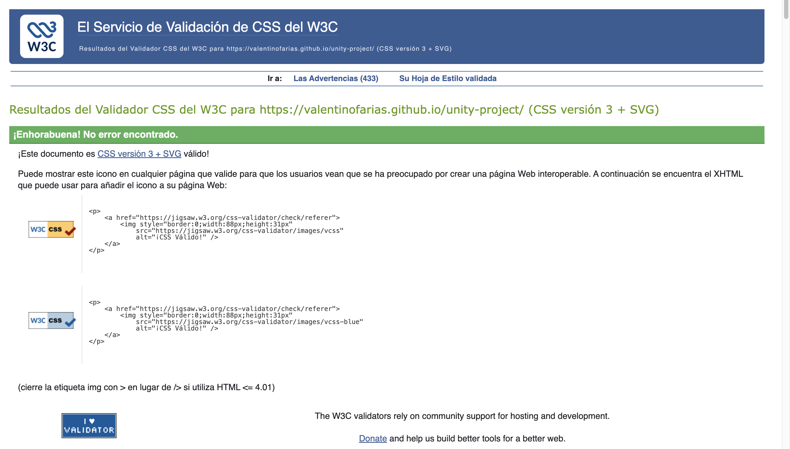

# Individual Formative Assignment 1

## Unity Project | Diversity and Inclusion



**Author:** James Jarvis-Bicknell

**This project was developed as part of my 16-week full-stack development bootcamp with Code Institute. It brings together what we have learned from the front-end side of the course: HTML and CSS essentials + Bootstrap.**

## Purpose: 

The purpose of this website is to enable external users to discover accessible, beginner-friendly information on mental health, including how to recognize common issues and manage stress, presented in a supportive and organised layout. As a site owner, the site is designed to create a welcoming space that offers approachable and basic mental health information using a clean and supportive design. 

The website was created with an awareness of the context surrounding mental health and an appreciation that it can be a daunting and overwhelming task to find simple and easily digestable information. Therefore, every decision was guided by the idea that this site could be used to simplify the landscape a bit, as a non-exhaustive first 'port of call' to enable users to get their bearings without drowning in information.

The website has been built using HTML, CSS and Bootstrap. Google Fonts and Font Awesome were also used. 

## Features: 

### Current Features

- Navigation 
- About Section 
- Common Issues section
- Tools and Tips section
- Resources section 
- Contact Form 
    - and Success Page
- Footer

### Future Features 
- Carousel of positive affirmations / inspiring quotes
- 'Daily mood check-in' section
- Interactive quiz for insight into stress levels with encouraging feedback tailored to quiz results

## Deployment 

### GitHub pages

For a live preview of the site, the code has been deployed via GitHub pages, this has been done at the start of the project to implement device testing as the build progresses.

The steps to deploy via GitHub pages are as follows:

1. Log into Github account.
2. Navigate to the Repository.
3. Click the 'Settings' option at the top of the repository.
4. Click the 'Pages' option on the left-hand menu, located near the bottom.
5. Within the 'Build and Deployment' section, select the drop-down titled 'None' under 'Branch' and select 'Main'.
6. Click 'Save'.
7. Refresh the page (this can take a few moments), and you will be prompted with a URL to your deployed site at the top of the page.
8. Click 'Visit site' to open the deployed site in a new tab.

### How to view the Project:

- [View the deployed site](https://jamiejb123.github.io/mental-health-awareness-project/)

## AI Use

### Uses:

- Expand / refine user stories into tasks and acceptance criteria
- Content generation: the images and much of the copy
- Used to generate some of the meta content
- To assist with problem-solving / bug fixes
- Code review and optimisation - particularly in relation to semantics and accessibility

### AI Usage Reflection

AI played a supportive but carefully managed role throughout the development of the ••Healthy Mind•• website. During the initial ideation phase, AI was used to expand and refine user stories, suggesting additional tasks, features, and acceptance criteria. These ideas were always critically assessed for relevance and alignment with the project goals.

Although I deliberately chose to write all the HTML and CSS independently to strengthen my own understanding, AI was used strategically for specific tasks where it added value. For example, once the site structure was in place, AI proved highly effective for content generation — e.g. generating imagery, logos, and copy. 

Problem-solving was another key area where AI was valuable. When I encountered specific bugs, AI tools such as Copilot in VS Code and browser DevTools AI chat provided helpful insights. Rather than asking for full solutions, I used AI to explore the problem space and identify potential causes, which helped me better understand the issues and decide on appropriate fixes.

Finally, AI was used to review and optimise my code for accessibility and semantic clarity. Some suggestions were useful but others were irrelevant, so each had to be reviewed on a case by case basis.

In summary, AI was a valuable tool for idea generation, content support, problem-solving, and code refinement. However, it was not a replacement for understanding. Developmental control remained firmly with me throughout, and the project benefited most when AI was used as a collaborative assistant rather than a solution provider.

## Design Choices:

### Colours: 

For my colour palette, I took inspiration from [pinterest](https://uk.pinterest.com/pin/823947694363170020/). For this website I wanted to evoke an inviting sense of warmth and calm as well as creating a playful, light-hearted and accessible feel. This selection tries to balance these two goals by using vibrant colours softened through pastel tones. 


### Typography: 

The following fonts were selected from [Google Fonts](https://fonts.google.com/) to further support the balance between calm / accessible and playful / light. Quicksand was chosen as the main typeface for its readability, accessibility and gentleness. Dynapuff was chosen for the major headings to inject a sense of playfulness into the site and balance out the potentially heavy subject-matter. 


### Images and Icons:

Wherever icons were used in this project (resources section and footer), they were taken from [Font Awesome](https://fontawesome.com/).

All images in this project were AI generated using [Microsoft Copilot](https://copilot.microsoft.com/chats/mpxbm6uP1PJA8vUpBgf1Y). This was used for several reasons: 
1. Avoid any possible copyright issues.
2. The colour palette was chosen before images. Therefore, using AI made it more straightforward to find images coherent with the colour scheme.
3. I did not want photorealistic images and feeding AI prompts enabled image-generation in keeping with the playful feel I was aiming for.

## Wireframes:

The basic structure of Healthy Mind was worked out using the wireframe software [BALSAMIQ](https://balsamiq.com/?gad_source=1&gad_campaignid=203404003&gbraid=0AAAAAD3BuzMO_b68z_FDD6MbtQx7bQ_6V&gclid=CjwKCAjwruXBBhArEiwACBRtHYXoWEdqjT_KJt9p8mXI8IdiipWikWrlgDIK9-gS3FKGd6jtQpN4qxoCpiQQAvD_BwE), to guide my development choices when coding. Over the project the vision for the layout changed and new sections were incorporated. An updated set of wireframes were created to reflect this. I have included both the original wireframes and the updated wireframes for comparison. 

### Desktop: 

- [Wireframe 1: Hero, About, Common Issues](assets/readme-documentation/updated-wireframes/desktopwireframe1.png)
- [Wireframe 2: Tips, Resources](assets/readme-documentation/updated-wireframes/desktopwireframe2.png)
    - [~~Initial Wireframe~~](assets/readme-documentation/initial-wireframe/desktop-initial-wireframe.png)

### Tablet:

- [Wireframe 1: Hero, About, Common Issues](assets/readme-documentation/updated-wireframes/tabletwireframe1.png)
- [Wireframe 2: Tips, Resources](assets/readme-documentation/updated-wireframes/tabletwireframe2.png)
    - [~~Initial Wireframe~~](assets/readme-documentation/initial-wireframe/tablet-initial-wireframe.png)

### Mobile: 

- [Wireframe 1: Home, About, Common Issues](assets/readme-documentation/updated-wireframes/mobilewireframe1.png)
- [Wireframe 2: Tips, Resources, Contact](assets/readme-documentation/updated-wireframes/mobilewireframe2.png)
    - [~~Initial Wireframe~~](assets/readme-documentation/initial-wireframe/mobile-initial-wireframe.png)

## Technologies: 

### Languages: 

- [HTML](https://en.wikipedia.org/wiki/HTML5)
- [CSS](https://en.wikipedia.org/wiki/CSS) 
- [Markdown](https://en.wikipedia.org/wiki/Markdown)

### Other Technologies, Frameworks & Libraries: 

- [Bootstrap 5](https://en.wikipedia.org/wiki/Bootstrap_(front-end_framework))
- [Google Fonts](https://fonts.google.com/)
- [Font Awesome](https://fontawesome.com/)
- [Visual Studio Code](https://code.visualstudio.com/)
- [Git](https://git-scm.com/)
- [GitHub](https://github.com/)
- [BALSAMIQ](https://balsamiq.com/?gad_source=1&gad_campaignid=203404003&gbraid=0AAAAAD3BuzMO_b68z_FDD6MbtQx7bQ_6V&gclid=CjwKCAjwruXBBhArEiwACBRtHYXoWEdqjT_KJt9p8mXI8IdiipWikWrlgDIK9-gS3FKGd6jtQpN4qxoCpiQQAvD_BwE)
- [Coolors](https://coolors.co/)
- [Pinterest](https://uk.pinterest.com/)
- [Stack Overflow](https://try.stackoverflow.co/get-teams/?utm_source=adwords&utm_medium=ppc&utm_campaign=kb_teams_search_brand_emea-dach&_bt=657236278306&_bk=stack+overflow&_bm=p&_bn=g&gad_source=1&gad_campaignid=10618329760&gbraid=0AAAAADlO0L1YSj_Ax7ln3HiA8-oM9nEWP&gclid=CjwKCAjwruXBBhArEiwACBRtHc83drtdIp0m7bMM_Ic-Al4NFRQfCG4HOKmsIk1dWiAjrPGmGlD3UxoCNCcQAvD_BwE)

## Testing

For testing, I made use of multiple resources: HTML and CSS validators, Chrome Dev Tools Lighthouse tests, thorough user testing, and WAVE accessibility evaluation tools. Errors and bugs found during the testing stage will be noted in the Bugs and Fixes section.

### Tests

[HTML Validator](https://validator.w3.org/)

All HTML pages have been tested with the w3c validator and passed with no errors. 


[Jigsaw CSS Validator](https://jigsaw.w3.org/css-validator/)

Stylesheet has been passed through the CSS validator and passed with no errors.



[WAVE Accessibility Evaluation Tool](https://wave.webaim.org/)

Page was accessibility evaluated with WAVE accessibility evaluation tool. There were no errors or contrast errors, but one alert was produced related to the footer text which was styled like a header but did not use a heading element. This was ignored because it was an intentional choice related to accessibility (i.e. maintaining the sequentially-descending order of headings in the document).


[Chrome Dev Tools - Lighthouse](https://developer.chrome.com/docs/lighthouse/overview/)

When running lighhouse tests, I used an incognito window to avoid any possible interference in the results from my Chrome extensions. 

- index.html 
    - Desktop
        - [Lighhouse test 1](assets/readme-documentation/lighthouse-report1.png) 
        - [Lighthouse test 2](assets/readme-documentation/lighthouse-report2.png)
        - Originally the performance and accessibility scores were lower than ideal. 
        
        To address performance, Lighthouse recommended reformatting images into 'next-gen' formats (e.g. webP or AVIF) and properly sizing images. Images were resized using an [image resizer tool](https://www.img2go.com/resize-image) and were converted to webP using an [image converter tool](https://cloudinary.com/tools/png-to-webp). This resolved the performance issues.
        
        To address accessibility, Lighthouse highlighted that the buttons didn't have accessible names and the heading elements were not sequentially-descending. Unnecessary buttons were removed from the page, the page was scanned with co-pilot for accessibility improvements (and aria-labels were added), and the ```<h4>``` element in the footer was replaced with a ```<p>```element styled as a header. This resolved the accessibility issues. 
    - Mobile 
        - [Lighthouse test](assets/readme-documentation/index-mobile-lighthouse-report.png)

        Performance could have been improved by resizing images specifically for mobile (as they had been resized for largest viewport) and reducing largest contentful paint. However, the performance was still acceptable and, given the scope of this project, I decided that I would leave it for now. 
- success.html 
    - Desktop
        - [Lighthouse test](assets/readme-documentation/success-desktop-lighthouse-report.png)
    - Mobile 
        - [Lighthouse test](assets/readme-documentation/success-mobile-lighthouse-report.png)

        The success page was a simple HTML page and the lighthouse report was good. No improvements required.

## Bugs & Fixes

### Combining CSS grid with Bootstrap cards:
One key issue encountered during development involved combining CSS Grid with Bootstrap cards. The cards were not expanding to fill the space assigned to them within the grid layout. This led to inconsistent spacing and a broken visual structure.

To diagnose the issue, I used the AI chat embedded within DevTools, which helped me examine the relevant code and pinpoint the root cause. The problem stemmed from Bootstrap’s default flex properties, which were overriding the expected grid behavior.

The solution involved overriding Bootstrap’s defaults with custom CSS to ensure that the cards expanded correctly within the grid. This resolved the layout issue and improved the responsiveness and consistency of the design.

### Browser Scroll Behaviour
I encountered an issue where scroll-padding-top—used to prevent the fixed navbar from overlapping content during internal navigation—suddenly stopped working. I had also added custom JavaScript (borrowed from a previous project) to collapse the Bootstrap navbar toggler on internal link clicks. Using Microsoft Copilot in VS Code, I investigated the issue and identified that the custom JavaScript was overriding the browser’s default scroll behavior. By isolating and testing parts of the script, I was able to remove the conflicting code while preserving the intended navbar collapse functionality.

## Credits

- [Stack Overflow](https://stackoverflow.com/questions) to explore certain problems and get ideas about the issue.
- [Kevin Powell](https://www.youtube.com/@KevinPowell) for helping me understand CSS grid so that I could incorporate it in my project.
- [W3Schools](https://www.w3schools.com/) and [MDN WebDocs](https://developer.mozilla.org/en-US/) were a major resource for answering questions and figuring out problems.
- [Code Institute](https://codeinstitute.net/) for providing a supportive learning environment, great resources and great tuition.