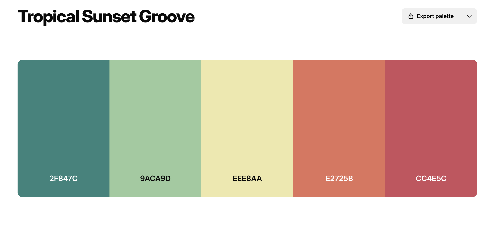
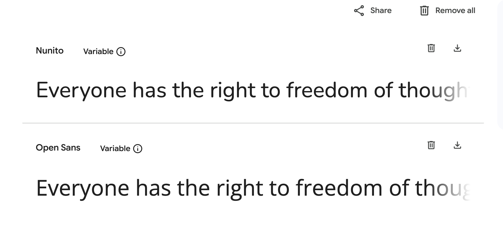
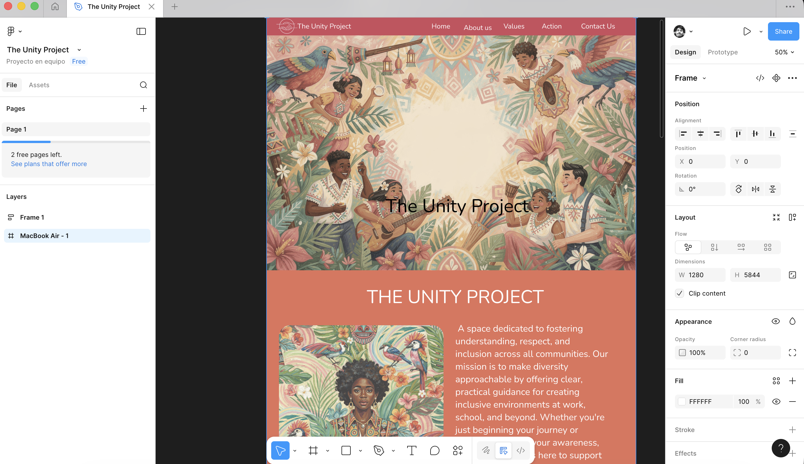
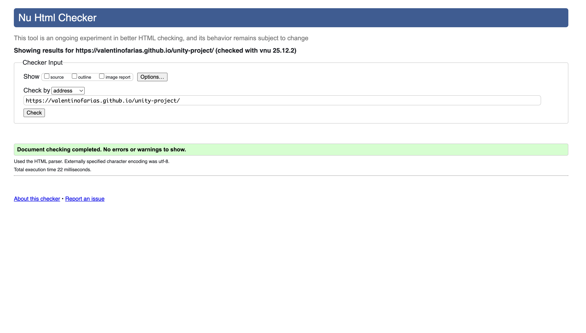

# Individual Formative Assignment 1

## Unity Project | Diversity and Inclusion

**Author:** Valentino Farias

**This project was developed as part of my 16-week full-stack development bootcamp with Code Institute. It brings together what we have learned from the front-end side of the course: HTML and CSS essentials + Bootstrap.**

## Purpose: 

The purpose of this website is to enable external users to discover accessible, beginner-friendly information on diversity and inclusion, including how to recognize common challenges and foster inclusive practices, presented in a supportive and organised layout. As a site owner, the site is designed to create a welcoming space that offers approachable and foundational diversity and inclusion resources using a clean and supportive design.
The website was created with an awareness of the context surrounding diversity and inclusion and an appreciation that it can be a daunting and overwhelming task to find simple and easily digestible information. Therefore, every decision was guided by the idea that this site could be used to simplify the landscape a bit, as a non-exhaustive first 'port of call' to enable users to get their bearings without drowning in information.
The website has been built using HTML, CSS and Bootstrap. Google Fonts and Font Awesome were also used. 

## Features: 

### Current Features

- Navigation 
- About Section 
- Values section
- Actions section
- Contact Form 
    - and Success Page
- Footer

### Future Features 
- Carousel of positive affirmations / inspiring quotes

## Deployment 

### GitHub pages

For a live preview of the site, the code has been deployed via GitHub pages, this has been done at the start of the project to implement device testing as the build progresses.

The steps to deploy via GitHub pages are as follows:

1. Log into Github account.
2. Navigate to the Repository.
3. Click the 'Settings' option at the top of the repository.
4. Click the 'Pages' option on the left-hand menu, located near the bottom.
5. Within the 'Build and Deployment' section, select the drop-down titled 'None' under 'Branch' and select 'Main'.
6. Click 'Save'.
7. Refresh the page (this can take a few moments), and you will be prompted with a URL to your deployed site at the top of the page.
8. Click 'Visit site' to open the deployed site in a new tab.

### How to view the Project:

- [View the deployed site](https://valentinofarias.github.io/unity-project/)

## AI Use

### Uses:

- Expand / refine user stories into tasks and acceptance criteria
- Content generation: the images and much of the content
- Used to generate some of the meta content
- To assist with problem-solving / bug fixes
- Code review and optimisation - particularly in relation to semantics and accessibility

### AI Usage Reflection

AI played a supportive but carefully managed role throughout the development of the ••Diversity & Inclusion Project•• website. During the initial ideation phase, AI was used to expand and refine user stories, suggesting additional tasks, features, and acceptance criteria. These ideas were always critically assessed for relevance and alignment with the project’s goals of fostering inclusivity and accessibility.
Although I deliberately chose to write all the HTML and CSS independently to strengthen my own understanding, AI was used strategically for specific tasks where it added value. For example, once the site structure was in place, AI proved highly effective for content generation — e.g. creating inclusive imagery, designing logos that reflected diversity, and drafting copy that emphasized equity and belonging.
Problem-solving was another key area where AI was valuable. When I encountered specific bugs, AI tools such as Copilot in VS Code and browser DevTools AI chat provided helpful insights. Rather than asking for full solutions, I used AI to explore the problem space and identify potential causes, which helped me better understand the issues and decide on appropriate fixes.
Finally, AI was used to review and optimise my code for accessibility and semantic clarity, ensuring that the site aligned with best practices for inclusive design. Some suggestions were useful but others were irrelevant, so each had to be reviewed on a case-by-case basis.
In summary, AI was a valuable tool for idea generation, content support, problem-solving, and code refinement. However, it was not a replacement for understanding. Developmental control remained firmly with me throughout, and the project benefited most when AI was used as a collaborative assistant rather than a solution provider.

## Design Choices:

### Colours: 

 For this website I wanted to evoke a strong sense of inclusivity and representation, while also creating an approachable, empowering, and accessible feel. The design aims to reflect diversity by combining bold, contrasting colours that celebrate difference with balanced tones that ensure clarity and cohesion.

### Typography: 

The following fonts were selected from Google Fonts to reinforce the balance between approachable / inclusive and dynamic / engaging. Open sans was chosen as the primary typeface for its clarity, friendliness, and ease of reading. Nunito was selected for the main headings to bring energy and vibrancy to the site, helping to counterbalance the seriousness of the subject matter with a sense of positivity and celebration.

### Images and Icons:

Wherever icons were used in this project (resources section and footer), they were taken from [Font Awesome](https://fontawesome.com/).

All visuals in this project were AI generated using OpenArt.ai. This approach was chosen for several reasons:
1. To ensure freedom from potential copyright concerns.
2. The design palette was established prior to image creation, so using AI made it easier to generate visuals that aligned seamlessly with the chosen colours.
3. I wanted illustrations that conveyed inclusivity and representation rather than photorealism, and prompting AI allowed me to produce imagery that reflected these values in a cohesive and intentional way.

## Wireframes:

The basic structure of the Diversity & Inclusion site was initially developed using the design platform Figma, which guided my decisions when moving into coding. As the project evolved, the vision for the layout expanded and new sections were introduced to better reflect the themes of inclusivity and representation. An updated set of wireframes was produced to capture these changes. I have included both the original wireframes and the revised versions for comparison. 

## Technologies: 

### Languages: 

- [HTML](https://en.wikipedia.org/wiki/HTML5)
- [CSS](https://en.wikipedia.org/wiki/CSS) 
- [Markdown](https://en.wikipedia.org/wiki/Markdown)

### Other Technologies, Frameworks & Libraries: 

• Bootstrap 5
• Google Fonts
• Font Awesome
• Visual Studio Code
• Git
• GitHub
• Coolors
• Figma
• OpenArt.ai

## Testing

For quality assurance, I relied on a range of tools and methods: code validation checks for HTML and CSS, performance audits through Chrome DevTools Lighthouse, extensive usability trials with different users. Any issues or glitches identified during this stage are documented in the Bugs and Fixes section.

### Tests

[HTML Validator](https://validator.w3.org/)

All HTML pages have been tested with the w3c validator and passed with no errors. 

[Jigsaw CSS Validator](https://jigsaw.w3.org/css-validator/)

Stylesheet has been passed through the CSS validator and passed with no errors.

[Chrome Dev Tools - Lighthouse](https://developer.chrome.com/docs/lighthouse/overview/)

When running lighhouse tests, I used an incognito window to avoid any possible interference in the results from my Chrome extensions. 

- index.html 
    - Desktop
        - [Lighhouse test 1](assets/readme-documentation/devtools-lighthouse.png) 
      
        
    

## Bugs & Fixes

### Footer and Icon Alignment
One key issue encountered during development involved the footer and its embedded icons. The icons were not aligning properly within the footer’s grid, which led to uneven spacing and a visually unbalanced layout.
To diagnose the issue, I used the AI chat embedded within DevTools, which helped me inspect the relevant CSS and identify the root cause. The problem stemmed from conflicting margin and flex properties that were applied by default, overriding the intended alignment rules.
The solution involved introducing custom CSS overrides to reset the default spacing and applying consistent flexbox rules. This ensured the icons aligned neatly within the footer, restoring balance and improving the overall design consistency.

### Values Section and Clickable Images
I also encountered an issue within the values section, where images unintentionally became clickable. This created confusion for users, as the images appeared to function like links without any defined destination.
Using Microsoft Copilot in VS Code, I investigated the issue and discovered that the images had inherited anchor-like behavior due to surrounding container properties. By isolating the section and testing different configurations, I was able to strip away the unintended click functionality while preserving the intended styling.
The fix involved adjusting the HTML structure and removing unnecessary attributes, ensuring that the values section displayed static, non-clickable images. This resolved the usability issue and reinforced clarity in the site’s design.

## Credits

- [Openart.ia](https://openart.ai/home) to explore certain problems and get ideas about the issue.

- [W3Schools](https://www.w3schools.com/). 
- [Code Institute](https://codeinstitute.net/) for providing a supportive learning environment, great resources and great tuition.
- [jamiejb123] (https://jamiejb123.github.io/mental-health-awareness-project/). Providing general structure and ideas of the whole proejct.